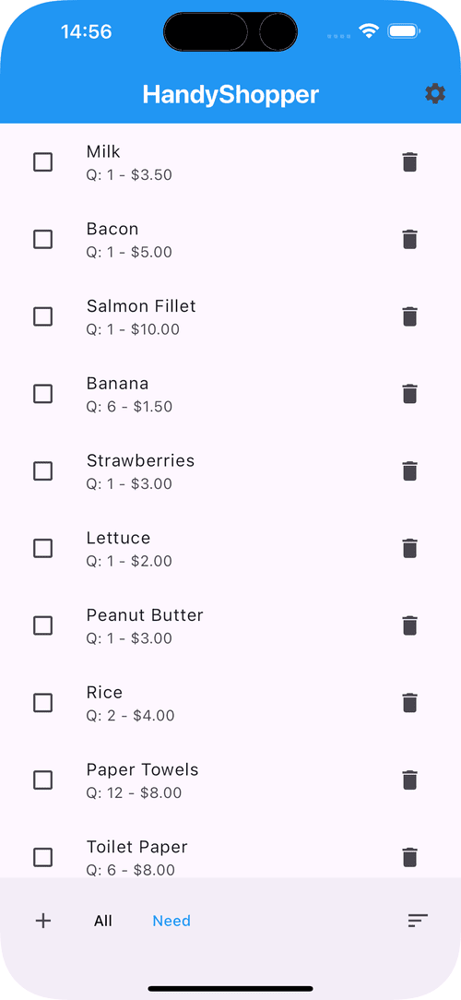
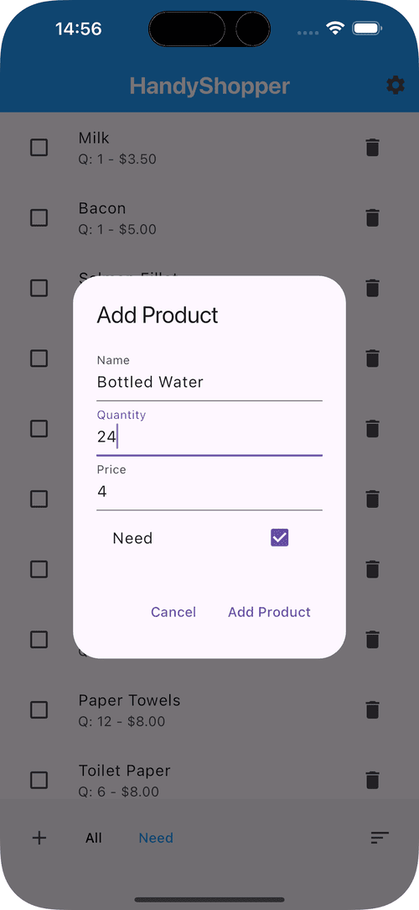
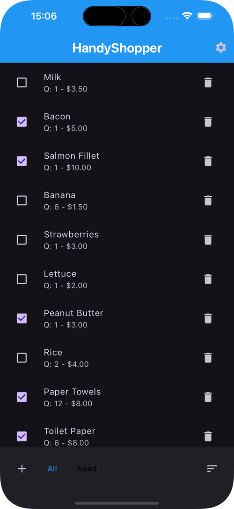

# HandyShopper

HandyShopper is a mobile shopping‑list app that brings the depth of the classic
Palm OS *HandyShopper* to modern Flutter. **Version 2.0** is a ground‑up rebuild
on a relational data model, adding multiple lists, categories, per‑store price
comparison, tax/VAT and checkout, notes, and full backup/sharing — while staying
simple for a quick grocery run.

## Features

### Lists ("databases")
- **Multiple lists** — keep separate lists (groceries, hardware, gifts…), each
  with its own items, categories, stores and settings.
- **List styles** — Shopping, To‑do, Dated, and Check lists.
- **Copy, share & back up** — duplicate a list, share it as readable text or an
  importable file, and export/import a whole‑app or per‑list JSON backup.
- **Emoji icons** for lists and categories.

### Items
- **Full item detail** — name, quantity & unit, price, note, category,
  priority (1–5), aisle, and (for dated lists) a date.
- **Categories** — create custom categories with emoji icons, assign items, and
  filter the list by category.
- **Per‑item notes** — a dedicated note editor.
- **All / Need views** — mark items as needed and check them off while shopping.
- **Sort & reorder** — by name, quantity, price, priority, aisle, or date, plus
  manual drag‑to‑reorder.
- **Configurable columns** — choose which fields each list shows on its rows.

### Prices, stores & tax
- **Per‑store prices** — record a price and aisle per store for each item and
  **compare prices across stores**, with the cheapest highlighted.
- **Store selector** — switch the displayed prices and running total by store.
- **VAT / sales tax** — per‑list tax rate (and an optional second tax), in either
  **add‑on** (sales‑tax) or **inclusive** (VAT) mode.
- **Checkout** — tally subtotal, tax and total, then mark items purchased.
- **Currency selection** for prices.

### General
- **Dark mode** — adapts to your device theme.
- **20 languages** — fully localized (see below).

## Screenshots

<p align="center">
  
  
  
</p>

## Localizations

English (en), Bengali (bn), German (de), Spanish (es), Persian (fa),
French (fr), Hindi (hi), Italian (it), Japanese (ja), Korean (ko),
Marathi (mr), Punjabi (pa), Portuguese (pt), Russian (ru), Tamil (ta),
Telugu (te), Turkish (tr), Urdu (ur), Vietnamese (vi), Chinese (zh).

All 20 languages cover the full v2.0 string set (English is used as a runtime
safety‑net fallback should a key ever be missing).

## Architecture

v2.0 is built on a small, testable layering:

- **SQLite** (`sqflite`) with a relational schema — `lists`, `categories`,
  `stores`, `items`, `item_store_prices` — owned by a single `DatabaseService`
  that also handles versioned migrations (v1 → v4) with zero data loss.
- **Provider** state management — `ListProvider`, `ItemProvider`,
  `CategoryProvider`, `StoreProvider`, `SettingsProvider`, scoped to the active
  list via `ChangeNotifierProxyProvider`.
- **Screens** under `lib/screens/` (lists, item list, item detail, note editor,
  category & store management, list settings, checkout); pure helpers under
  `lib/data/` (tax, share text, column flags) kept free of Flutter for unit
  testing.
- **Tests** under `test/` cover the data layer, migrations, providers, tax math,
  backup round‑trips, and localization key parity.

## Getting Started

### Prerequisites

- Flutter SDK and Dart SDK

### Installation

```sh
git clone https://github.com/LuminaAppsDev/handyshopper.git
cd handyshopper
flutter pub get
flutter run
```

### Build & quality checks

```sh
flutter build appbundle --debug   # build
dart analyze                      # lint (very_good_analysis, zero issues)
flutter test                      # unit/widget tests
```

### Play Store signing

The Android release build is signed with a key defined in
`android/key.properties`:

```
storePassword=MyStorePassw0rd
keyPassword=MyKeyPassw0rd
keyAlias=play-store_release
storeFile=play-store_release-key.keystore
```

The key file itself goes at `android/app/play-store_release-key.keystore`.

## Usage

- **Lists** — the app opens to your lists; tap one to open its items, or **+** to
  create a new list. A list's ⋮ menu offers rename/edit, icon, copy, delete,
  share, and export.
- **Items** — **+** opens the full item editor; tap an item to edit it. Toggle
  **All / Need**, and tap an item's checkbox to check it off.
- **Categories & stores** — manage them from the item editor (or the store
  selector) and filter/compare by them.
- **List settings** — per‑list options: per‑store prices, tax rate & mode, and
  visible columns.
- **Checkout** — the receipt icon tallies the needed items and marks them
  purchased.
- **Backup** — use the lists screen's menu to back up all lists or restore from
  a file.

## Contributing

Contributions are welcome — please fork the repository and open a pull request.
Run `dart analyze` and `flutter test` (both should be clean) before submitting.

## License

This project is licensed under the MIT License — see the [LICENSE](LICENSE) file
for details.

## Acknowledgements

- Flutter
- provider
- sqflite / sqflite_common_ffi
- shared_preferences
- share_plus
- file_picker
- currency_picker
- intl
